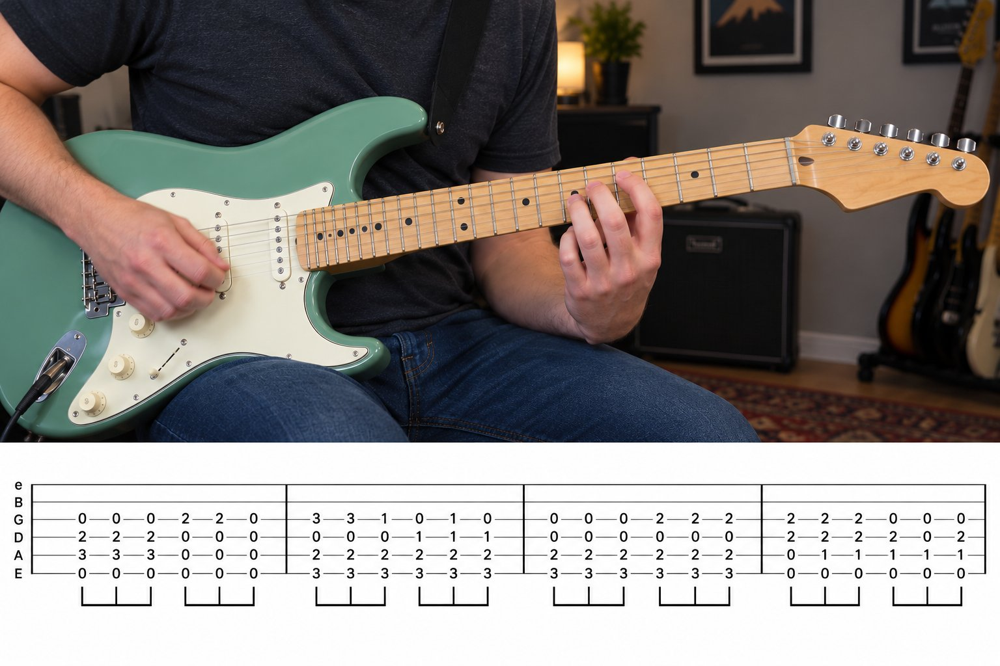
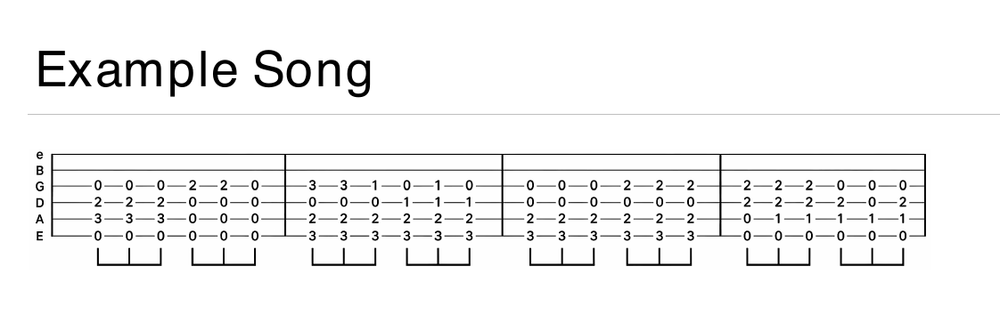

# youtabber

Turns a YouTube play-along video into a clean, printable PDF of its tab.

## TL;DR

```sh
git clone https://github.com/brennanpowers/youtabber.git
uv tool install --editable ./youtabber              # needs uv and ffmpeg
youtabber "https://www.youtube.com/watch?v=..."     # writes out/<song-name>/<song-name>.pdf
```

Play-along videos usually show someone playing on one part of the screen and the tab on another,
with a cursor moving through it. youtabber finds the tab, removes the cursor, joins the pieces the
video shows over time into one continuous piece of music, and lays it out on Letter pages.

| A play-along video... | ...becomes a printable PDF |
|---|---|
|  |  |

<sub>The frame is a made-up example, not from a real video.</sub>

It handles the common layouts:

- Tab along the bottom or top of the frame, or in a box that covers only part of it
- Videos that show one line of tab at a time and swap in the next
- Videos that jump forward while keeping part of the previous view on screen
- Light colored highlight boxes and cursor lines, such as yellow, blue, or red

## Requirements

- [uv](https://docs.astral.sh/uv/)
- [ffmpeg](https://ffmpeg.org/) on your `PATH` (`brew install ffmpeg` on macOS)

## Install

```sh
git clone https://github.com/brennanpowers/youtabber.git
uv tool install --editable ./youtabber
```

This puts a `youtabber` command on your `PATH`. `--editable` runs the code straight from the clone,
so changes take effect without reinstalling. To run it without installing, use
`uv run youtabber ...` from inside the clone.

## Usage

```sh
youtabber "https://www.youtube.com/watch?v=..."
```

| Option | What it does |
|---|---|
| `SOURCE` | A YouTube URL or a local video file |
| `--title "Song - Artist"` | Sets the song name, when the one taken from the video title is wrong |
| `--region x,y,w,h` | Sets the tab area by hand, in video pixels, when detection gets it wrong |
| `--no-enhance` | Skips upscaling and sharpening, for a PDF about a third the size |
| `--model NAME` | Enhances with a super-resolution model instead; see [Models](#models) |
| `-o FOLDER` | Writes output somewhere other than `out/<song-name>/` |

The song name comes from the video title with phrases like "Bass Cover (Play Along Tabs)" removed.
Downloads are cached in `~/.cache/youtabber`, so running the same video again doesn't download it again.

### Output

Each run writes a folder, `out/<song-name>/` under the current directory by default:

| File | What it holds |
|---|---|
| `<song-name>.pdf` | The tab, headed with the song name and the channel that made the video |
| `region.png` | A frame with the detected tab area outlined; check this first when the PDF looks wrong |
| `views/` | Each distinct tab image the video showed, with the cursor removed |
| `strip.png` | Every view joined into one long line of music |
| `meta.json` | When each view was on screen, where it sits in the strip, and where rows were cut |

### Config

To also copy every finished PDF into one folder, create `~/.config/youtabber/config.toml`:

```toml
pdf_dir = "~/Documents/tabs"
enhance = false   # optional: skip upscaling and sharpening unless --enhance is passed
model = "realesrgan-anime"   # optional: enhance with a model; see Models
```

### Models

By default, enhancement upscales with Lanczos interpolation and sharpens with an unsharp mask. For
cleaner results, set `model` in the config or pass `--model` to run a super-resolution model instead.
Models need PyTorch, which is a large download, so they're an optional extra:

```sh
uv tool install --editable './youtabber[ai]'
youtabber "https://www.youtube.com/watch?v=..." --model realesrgan-anime
```

`realesrgan-anime` is [Real-ESRGAN](https://github.com/xinntao/Real-ESRGAN)'s line-art model, which
suits engraved notation better than the photo models. It downloads to `~/.cache/youtabber/models` on
first use. `model` also takes a path to any model file [spandrel](https://github.com/chaiNNer-org/spandrel)
can load, such as the ones on [OpenModelDB](https://openmodeldb.info). The model runs on the GPU when
one is available (Apple Silicon or CUDA).

Super-resolution models can invent detail. On the songs this was tested with, the line-art model
kept every fret number, notehead, ledger line, and beam, and differed from the source only in stroke
thickness. Check a new model against the video before trusting it.

### Fixing a wrong tab area

Run once, open `region.png`, and compare the outline with the tab. The run prints the detected area as
`Region(x=…, y=…, w=…, h=…)`; adjust those numbers and pass them back with `--region x,y,w,h`.

## How it works

1. **Find the tab area.** Staff lines are thin, dark, horizontal, and stay in the same place for the
   whole video. Averaging a thin-line mask over frames sampled across the video finds them, even
   though notes cover parts of them in any single frame. The area then grows over the surrounding
   paper to take in chord names and measure numbers.
2. **Find stable views.** Frames are compared by their ink only: pixels where every color channel is
   dark. Colored cursors and highlights aren't ink, so they don't count as changes. Each run of
   matching frames becomes one view, and taking the median of each pixel across the run erases the
   cursor.
3. **Stitch.** When a video jumps forward but keeps part of the previous view on screen, each new
   view is slid across the previous one to find where they overlap, and only the new part is kept.
   Bass lines often repeat a measure exactly, which can make several overlaps match. Players scroll
   the same distance every time, so the usual distance decides between them.
4. **Lay out.** Every song is scaled so its tab lines sit the same distance apart on paper, which
   makes notation print the same size whatever the video looked like. The music is cut at barlines
   into rows of even width, and blank paper above and below it is trimmed.
5. **Clean up.** Cutting at barlines splits the gray measure numbers that sit over them, so gray
   marks near a row's edges are erased, along with anything above or below the staves that an edge
   cuts through. Nothing on or between the staves is touched. Full pages spread their rows evenly.
6. **Enhance.** Unless turned off, each row's resolution is doubled, its edges are sharpened with an
   unsharp mask, and near-black is pushed to black and near-white to white. Light gray staff lines and measure
   numbers stay gray instead of being thresholded away.

## Limitations

- Videos that scroll smoothly instead of jumping aren't supported yet.
- The tab area is found partly from how notes move over time, so a video that shows one unchanging
  page of tab may need `--region`.
- Detection expects dark notation on light paper. Dark-themed tab won't be found.
- A video that shows standard notation above the tab produces taller rows, so its PDF runs longer.

## Keeping downloads working

YouTube changes often enough to break [yt-dlp](https://github.com/yt-dlp/yt-dlp) a few times a year.
If downloads start failing, update it:

```sh
uv tool upgrade youtabber
```

## Use

youtabber is for practicing with videos you have the right to use: your own, ones under a Creative
Commons license, or ones whose creator allows it. Tabs belong to the people who transcribe them and
the songs to their publishers, so keep the PDFs for your own practice and don't share them. YouTube's
terms of service also limit downloading, and following them is up to you. Please support the channels
whose work you learn from.

## License

The code is under the [MIT License](LICENSE).
